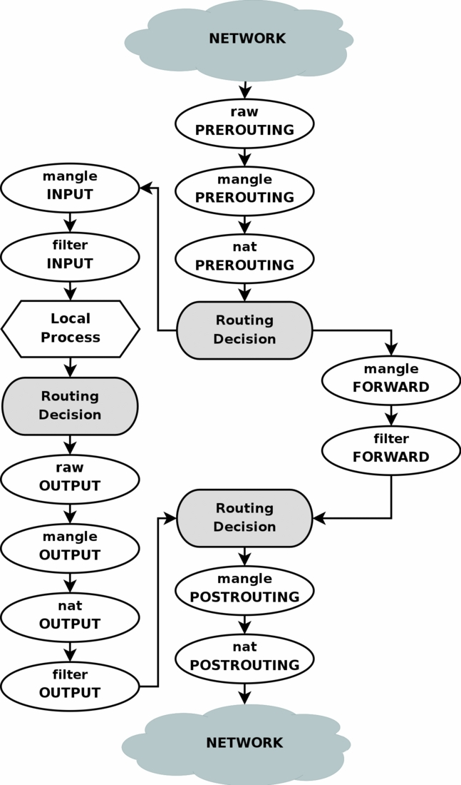

> 探究 ipvs 和 iptables 的工作时机，以及 linux 中路由表在其中扮演的角色。
>

# 流程图

结论：
> 均是在本机访问虚拟 ip 的情况下，若客户端是在外部，ipvs 应工作在 input 链

1. nat 模式中的 ipvs，其工作在output 的 nat 表和 filter 表之间，待进行地址转换后，重新走 output 链。
2. 通过 ipvs 设置的虚拟 ip，在 lb 本机访问时，第一步先查本地路由表，查看该目标地址使用哪条路由，走哪个网卡；第二步走 output 链，output 链中的动作见结论 1 。
